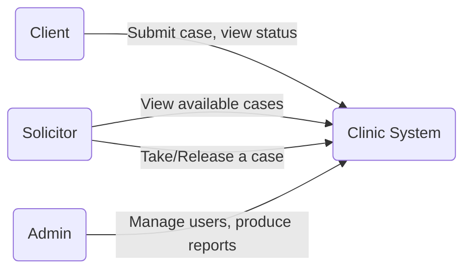
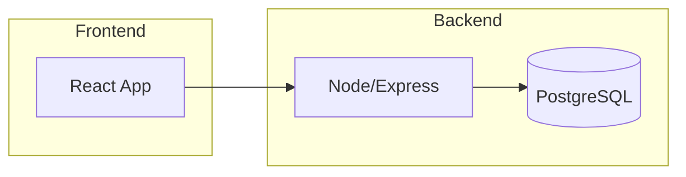
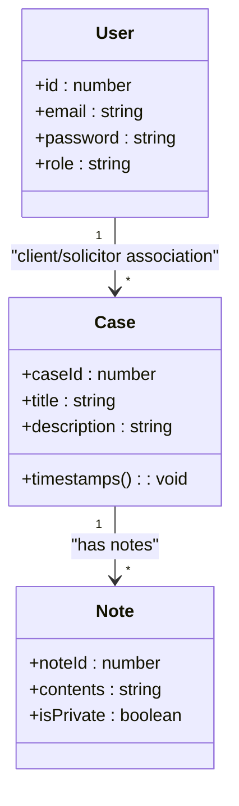
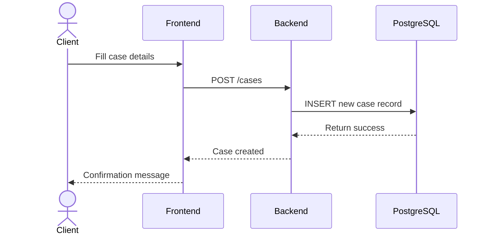

Below are some example UML diagrams in [Mermaid](https://mermaid.js.org/) syntax that you can adapt or expand for your project. These illustrate key system interactions, data flows, and components.

---

### 1. Use Case Diagram



**Key points:**
- Show the main actors: Client, Solicitor, Admin.  
- Outline their primary interactions (e.g., “Submit case,” “Manage users,” etc.).

---

### 2. High-Level Architecture Diagram



**Key points:**
- Represent front end (React), back end (Node/Express), and the database (PostgreSQL).  
- Show data flowing from the user’s browser to the backend and storage in the database.

---

### 3. Class Diagram (Simplified)



**Key points:**
- Focus on the major classes (User, Case, Note).  
- Show the cardinality (one-to-many, etc.).

---

### 4. Sequence Diagram (Client Submitting a New Case)



**Key points:**
- Illustrate the request flow when a client submits a new case.  
- Show database insertion and completion feedback.

---

### 5. Deployment Diagram (Docker Containers)

```mermaid
flowchart LR
    subgraph Host Machine
        direction TB
        A[Frontend Container\n(port 3333)] --> B[Backend Container\n(port 5555)]
        B --> C[Postgres Container\n(port 5432)]
    end
```

**Key points:**
- Show how your three containers (Frontend, Backend, Database) communicate.  
- Note ports and container relationships.

---

Use these diagrams or outline structures as starting points. You can refine them using your own tool (e.g., [Mermaid Live Editor](https://mermaid.live/), [Draw.io](https://app.diagrams.net/), or UML software) to adapt text, relationships, and classes to fit your exact workflow.